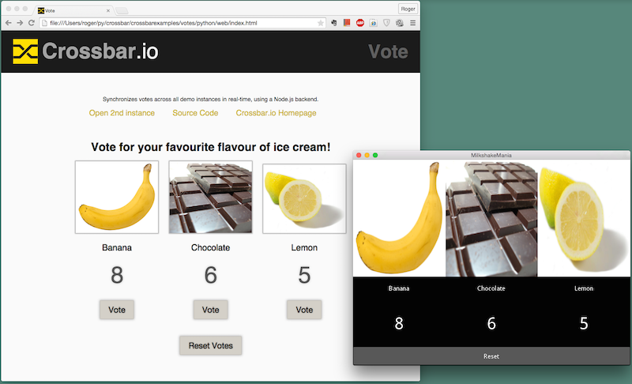

# Writing Kivy apps using Autobahn|Python

This example is another Votes showcase of how to use WAMP in a [Kivy](http://kivy.org/) app by
means of Autobahn|Python.

Below we will offer you the choice of running the this Kivy app in conjunction with a back-end component
running either on your localhost or available on Tavendo's server.

## Installing Kivy

### MS Windows
See the Crossbar/Kivy example, or [Kivy's web site](http://kivy.org/docs/installation/installation-windows.html).

### Mac OS X
Download the .dmg file from [Kivy's download page](http://kivy.org/#download) and follow the 
[instructions](http://kivy.org/docs/installation/installation-macosx.html#).
You can safely skip the [section with instructions to install the developer's version]
(http://kivy.org/docs/installation/installation-macosx.html#installing-the-dev-version)

## Choosing a router and back-end component
### Using a localhost based router and back-end
A Votes back-end component is needed: in case there would not be any front-end Votes
component running at all, the number of votes cast should still be kept.

The router decouples the components in your WAMP applications.

Use the python interpreter from Kivy to install crossbar within the virtualenv that Kivy is using:

#### 1 MS Windows
    <path_to_kivy>\python -m pip install crossbar

#### 1 Mac OS X
    kivy -m pip install crossbar

#### 2 All platforms
Obtain the examples provided by crossbar:

    git clone https://github.com/crossbario/crossbarexamples.git

Go to your crossbarexamples/votes/python folder and start the Crossbar router:

    crossbar start
which will start up a python back-end Votes component as well.

### Using a Tavendo based router and back-end

Tavendo has got a Crossbar router and Votes back-end component running already. Easy!

## Starting a browser based front-end Votes component

### Localhost based router and back-end
Open your web browser and visit either
`file:///crossbarexamples/votes/python/web/index.html` or `http://127.0.0.1:8080`

### Tavendo based router and back-end
Open your Web browser and visit `https://demo.crossbar.io/demo/votes/web:8080`.

This will open a javascript based Votes front-end component in your web browser.

## Starting the Kivy front-end component

Finally!

Clone the repository containing this example:

    git clone https://github.com/rogererens/voteskivycrossbarclient.git

Go to the folder that contains this README.md file. If you are using a Mac

    kivy -m pip install -r requirements.txt
    kivy main.py

other platforms should use

    python -m pip install -r requirements.txt
    python main.py

where python is the python interpreter used by Kivy.

This will start a Kivy based UI which incorporates a Votes front-end component.

You now can send messages between the browser front-end and the Kivy front-end
(in the latter, click the images to increase or reset the numbers):

#### Note
There may be other people be using a Votes front-end component using the same public
Crossbar.io server, so expect unexpected number of votes!

### Roadmap

- Android availability in Google Play (an .apk is available on request, contact me (worrelsik) on #autobahn at IRC) 
- iOS availability in Apple's App Store